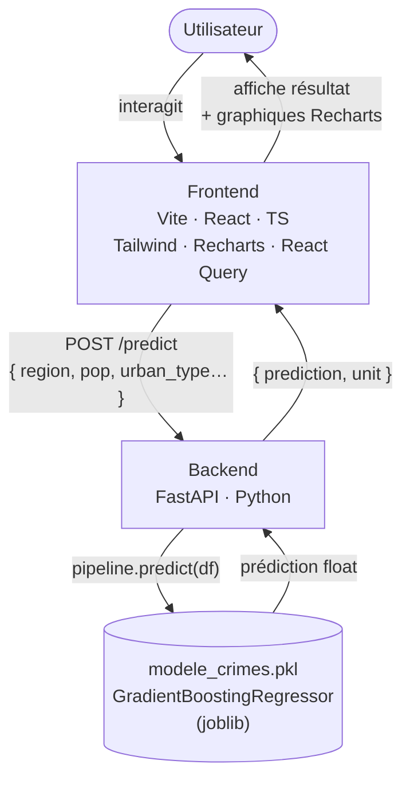

# Architecture

L'application est un monorepo organisé en deux services découplés : un frontend React servi par Vite et un backend FastAPI. Ce choix évite la complexité d'un déploiement microservices tout en gardant les responsabilités bien séparées — le frontend ne connaît pas le modèle, le backend ne connaît pas l'UI.

Le modèle `modele_crimes.pkl` (GradientBoostingRegressor, entraîné sous sklearn 1.6.1) vit dans le backend et est chargé une seule fois au démarrage via `joblib.load`. Chaque requête de prédiction lui est passée sous forme d'un DataFrame pandas reconstruit à partir du JSON reçu. Les données ne transitent jamais vers le frontend sous forme brute ; seule la valeur prédite (+ métadonnées) est retournée.

## Flux de données

| Étape | Acteur | Détail |
|---|---|---|
| 1 | Utilisateur | Remplit le formulaire (région, population, type urbain) |
| 2 | Frontend | Envoie `POST /predict` avec le payload JSON |
| 3 | Backend | Valide le payload (Pydantic), reconstruit le DataFrame |
| 4 | Modèle | `pipeline.predict()` → float (taux de criminalité) |
| 5 | Backend | Retourne `{ prediction, unit, confidence_interval }` |
| 6 | Frontend | Affiche le résultat, met à jour les graphiques Recharts |
