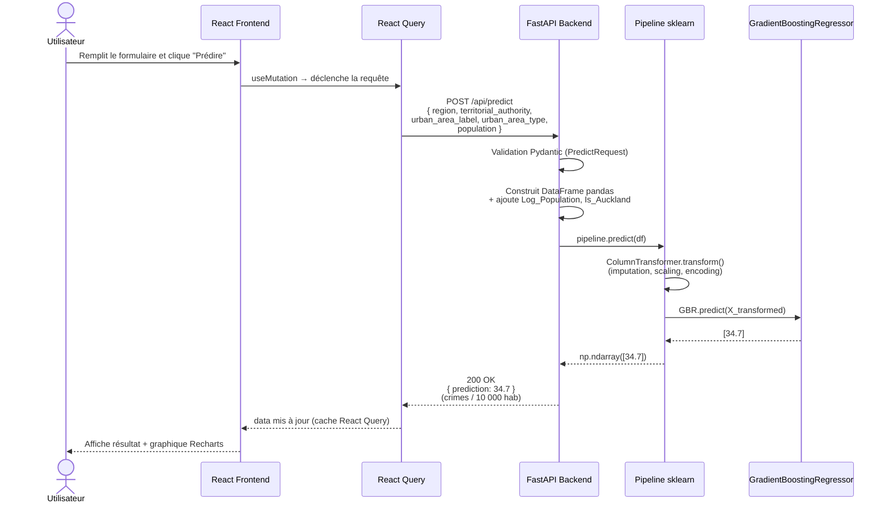

# Diagramme de séquence — Flux de prédiction

Décrit l'enchaînement technique complet lors d'une demande de prédiction, depuis le clic utilisateur jusqu'à l'affichage du résultat.

## Points d'erreur à gérer

| Cas | Réponse API | Comportement Frontend |
|---|---|---|
| Payload invalide (champ manquant) | `422 Unprocessable Entity` | Message de validation inline sur le formulaire |
| Région inconnue du modèle | `200` avec valeur prédite (OneHotEncoder `handle_unknown="ignore"`) | Avertissement "zone peu représentée" à ajouter en V2 |
| Backend inaccessible | Timeout / `503` | Toast d'erreur, retry automatique React Query |
