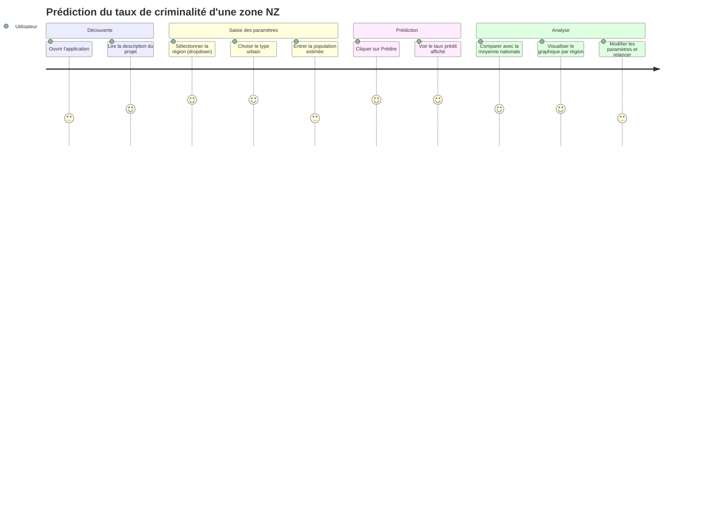

# User Journey

L'utilisateur cible est un analyste ou un citoyen curieux qui veut comparer le taux de criminalité estimé d'une zone néo-zélandaise avec d'autres zones similaires. Il n'a pas de connaissances en data science ; l'interface doit lui permettre de formuler une question géographique et d'obtenir une réponse chiffrée en quelques clics.

## Notes sur les scores

- **Saisie de la population (3/5)** : saisir un nombre brut est moins intuitif que de sélectionner dans une liste — envisager une aide contextuelle (ex : "Auckland ≈ 1,5 M hab").
- **Modifier et relancer (3/5)** : la friction augmente si le formulaire ne conserve pas les valeurs précédentes entre deux prédictions.
