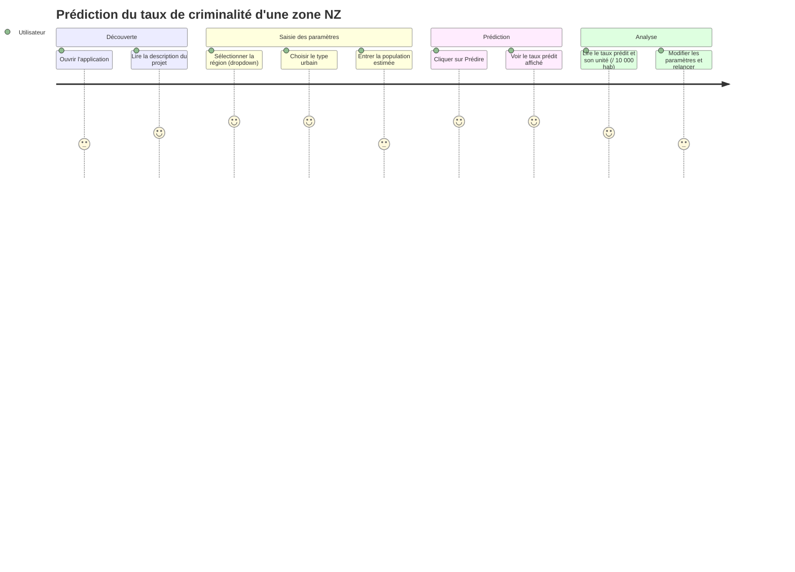

# User Journey

L'utilisateur cible est un analyste ou un citoyen curieux qui veut comparer le taux de criminalité estimé d'une zone néo-zélandaise avec d'autres zones similaires. Il n'a pas de connaissances en data science ; l'interface doit lui permettre de formuler une question géographique et d'obtenir une réponse chiffrée en quelques clics.

## Notes sur les scores (suite V1)

- **Saisie de la population (3/5)** : saisir un nombre brut est moins intuitif que de sélectionner dans une liste — envisager une aide contextuelle (ex : "Auckland ≈ 1,5 M hab").
- **Modifier et relancer (3/5)** : le formulaire V1 ne conserve pas les valeurs entre deux prédictions — friction confirmée en test.
- **Lecture du résultat (4/5)** : l'unité "crimes / 10 000 hab" n'est pas immédiatement compréhensible pour un non-initié — un tooltip ou une phrase de reformulation est nécessaire en V2.
- **Graphiques et contexte (manquant)** : l'absence de repère ("est-ce élevé par rapport à la moyenne NZ ?") rend la valeur prédite difficile à interpréter seule — à adresser via `/api/stats` en V2.
